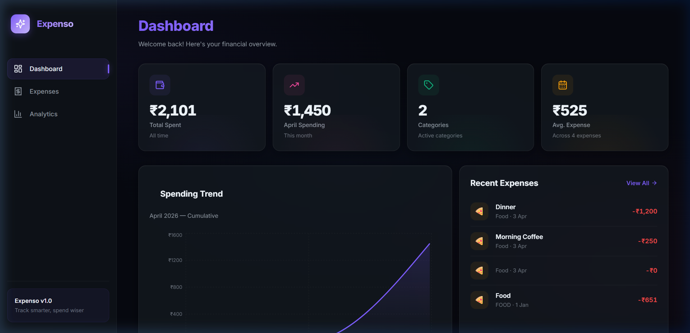
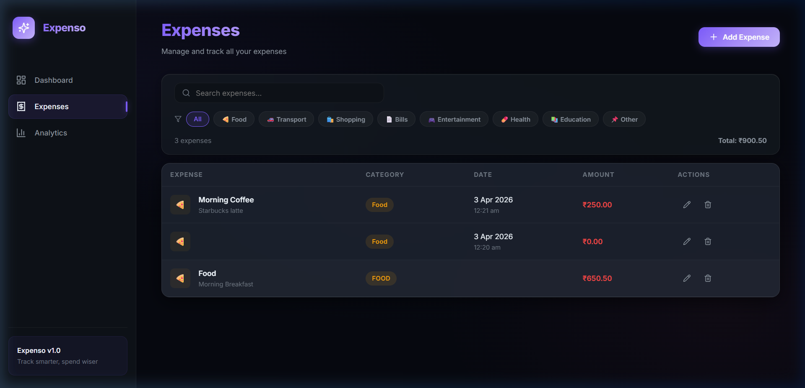
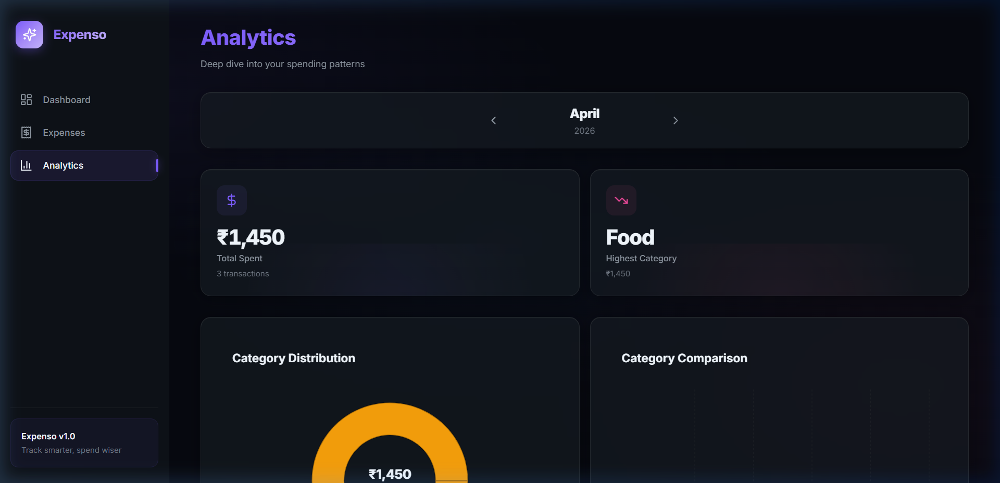
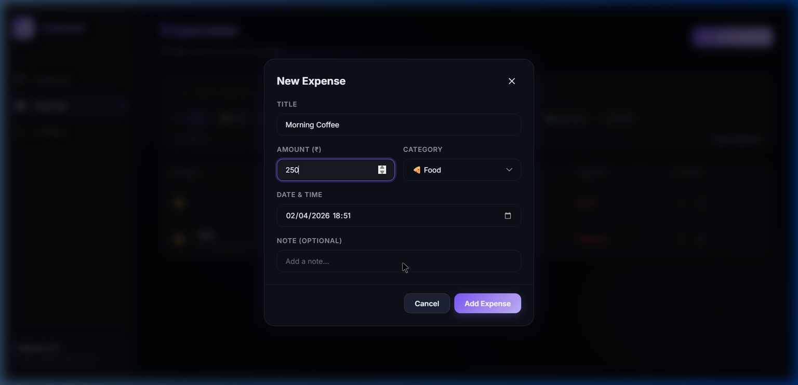

<div align="center">

# 💸 Expenso — Smart Expense Tracker

**A full-stack expense tracking application with a modern React dashboard and Spring Boot REST API**


</div>

---

## 📸 Screenshots

<div align="center">

| Dashboard | Expenses |
|:---------:|:--------:|
|  |  |

| Analytics | Add Expense |
|:---------:|:-----------:|
|  |  |

</div>

---

## 🔍 About

**Expenso** is a production-grade expense tracking application built with a decoupled architecture:

- **Backend** — Spring Boot REST API with JPA, MySQL, and DTO pattern
- **Frontend** — React 18 SPA with glassmorphism UI, interactive charts, and smooth animations

Track expenses by category, visualize spending trends with dynamic charts, and get monthly breakdowns — all through a sleek dark-themed interface.

---

## ✨ Features

### Frontend
- **Dashboard** — Overview with stat cards, cumulative spending area chart, and recent expenses
- **Dynamic Greeting** — Time-aware welcome message (Morning/Afternoon/Evening)
- **Expenses Page** — Full CRUD with search, category filter chips, edit/delete actions
- **CSV Export** — Export filtered expenses to CSV with one click
- **Analytics Page** — Monthly breakdown with donut chart, bar chart, and detailed table
- **Dark Glassmorphism UI** — Modern design with gradient accents and micro-animations
- **Responsive Design** — Adapts to desktop, tablet, and mobile screens

### Backend
- **RESTful API** — 7 endpoints for complete expense management
- **Input Validation** — Jakarta Bean Validation on all request DTOs
- **Structured Error Responses** — Consistent JSON error bodies with timestamps and status codes
- **SLF4J Logging** — Comprehensive logging across service and exception layers
- **Category Filtering** — Filter expenses by category
- **Date Range Queries** — Filter expenses within custom date ranges
- **Monthly Summary** — Aggregated spending with per-category breakdown
- **CORS Configured** — Ready for cross-origin frontend communication

---

## 🛠️ Tech Stack

| Layer | Technologies |
|-------|-------------|
| **Frontend** | React 18, Vite, Axios, Recharts, Framer Motion, Lucide React, React Hot Toast |
| **Backend** | Java 21, Spring Boot 3.5, Spring Data JPA, Jakarta Validation, Lombok |
| **Database** | MySQL 8.0 |
| **Styling** | Vanilla CSS with custom properties, Google Fonts (Inter) |

---

## 📁 Project Structure

```
Expenso/
├── Backend/                          # Spring Boot API
│   └── src/main/java/.../Backend/
│       ├── Config/                   # CORS configuration
│       ├── Controller/               # REST endpoints
│       ├── DTO/                      # Request/Response objects + ErrorResponse
│       ├── Exception/                # Global exception handler
│       ├── Model/                    # JPA Entity
│       ├── Repository/               # Data access layer
│       └── Service/                  # Business logic + logging
│
├── Frontend/                         # React + Vite SPA
│   ├── src/
│   │   ├── api/                      # Axios API service
│   │   ├── components/               # Sidebar, StatCard, ExpenseModal
│   │   ├── pages/                    # Dashboard, Expenses, Analytics
│   │   └── utils/                    # Export utilities (CSV)
│   ├── .env                          # API base URL config
│   ├── vercel.json                   # Vercel SPA routing
│   └── vite.config.js
│
└── README.md
```

---

## 🚀 Getting Started

### Prerequisites
- **Java 21** or higher
- **Maven** (or use the included `mvnw` wrapper)
- **Node.js 18+** and **npm**
- **MySQL 8.0** running locally

### 1. Database Setup
```sql
CREATE DATABASE expense_tracker;
```

### 2. Configure Backend
Edit `Backend/src/main/resources/application.properties`:
```properties
spring.datasource.url=jdbc:mysql://localhost:3306/expense_tracker
spring.datasource.username=YOUR_USERNAME
spring.datasource.password=YOUR_PASSWORD
```

### 3. Run Backend
```bash
cd Backend
./mvnw spring-boot:run
```
> Backend starts at `http://localhost:8080`

### 4. Run Frontend
```bash
cd Frontend
npm install
npm run dev
```
> Frontend starts at `http://localhost:5173`

---

## 📡 API Endpoints

| Method | Endpoint | Description |
|--------|----------|-------------|
| `POST` | `/expenso` | Create a new expense |
| `GET` | `/expenso` | Get all expenses |
| `GET` | `/expenso/{id}` | Get expense by ID |
| `PUT` | `/expenso/{id}` | Update an expense |
| `DELETE` | `/expenso/{id}` | Delete an expense |
| `GET` | `/expenso/byCategory?category=Food` | Filter by category |
| `GET` | `/expenso/filter?start=...&end=...` | Filter by date range |
| `GET` | `/expenso/summary?month=4&year=2026` | Monthly summary |

### Sample Request — Create Expense
```json
POST /expenso
{
  "title": "Morning Coffee",
  "category": "Food",
  "amount": 250.00,
  "note": "Starbucks latte"
}
```

### Sample Response — Monthly Summary
```json
GET /expenso/summary?month=4&year=2026
{
  "totalAmount": 1450.00,
  "categoryWise": {
    "Food": 1200.00,
    "Transport": 250.00
  }
}
```

---

## 📄 License

This project is licensed under the MIT License — see the [LICENSE](LICENSE) file for details.

---

## 🤝 Contributing

Contributions are welcome! Here's how to get started:

1. Fork the repository
2. Create a feature branch (`git checkout -b feature/amazing-feature`)
3. Commit your changes (`git commit -m 'Add amazing feature'`)
4. Push to the branch (`git push origin feature/amazing-feature`)
5. Open a Pull Request

---

## 📋 Changelog

### v1.1 (June 2026)
- ✅ CSV export for expenses
- ✅ Jakarta Bean Validation on request DTOs
- ✅ Structured JSON error responses
- ✅ SLF4J logging across service layer
- ✅ Time-aware dashboard greeting
- ✅ Improved `.gitignore` coverage

### v1.0 (May 2026)
- 🚀 Initial release with full CRUD, analytics, and glassmorphism UI

---

<div align="center">

**Built with ☕ and 💻**

</div>
